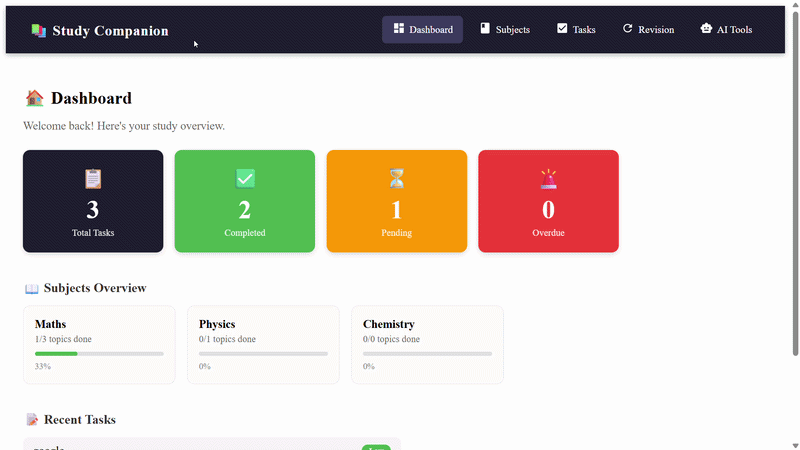

<div align="center">

<svg xmlns="http://www.w3.org/2000/svg" viewBox="0 0 900 200" width="900" height="200">
  <defs>
    <linearGradient id="bg" x1="0%" y1="0%" x2="100%" y2="100%">
      <stop offset="0%" style="stop-color:#1e1e2e;stop-opacity:1" />
      <stop offset="60%" style="stop-color:#2d2b55;stop-opacity:1" />
      <stop offset="100%" style="stop-color:#1a1a3e;stop-opacity:1" />
    </linearGradient>
    <linearGradient id="accent" x1="0%" y1="0%" x2="100%" y2="0%">
      <stop offset="0%" style="stop-color:#4f46e5;stop-opacity:1" />
      <stop offset="100%" style="stop-color:#7c3aed;stop-opacity:1" />
    </linearGradient>
  </defs>
  <rect width="900" height="200" rx="16" fill="url(#bg)" />
  <rect x="0" y="160" width="900" height="4" rx="2" fill="url(#accent)" />
  <circle cx="820" cy="40" r="60" fill="#4f46e5" opacity="0.08" />
  <circle cx="780" cy="160" r="40" fill="#7c3aed" opacity="0.08" />
  <circle cx="80" cy="160" r="50" fill="#4f46e5" opacity="0.06" />
  <text x="60" y="115" font-size="56" font-family="Segoe UI Emoji">📚</text>
  <text x="140" y="90" font-family="Segoe UI, Arial, sans-serif" font-size="38" font-weight="bold" fill="white" letter-spacing="1">AI Study Companion</text>
  <text x="142" y="125" font-family="Segoe UI, Arial, sans-serif" font-size="17" fill="#a5b4fc" letter-spacing="0.5">Your intelligent personal study management system</text>
  <rect x="142" y="140" width="90" height="22" rx="11" fill="#4f46e5" opacity="0.7"/>
  <text x="187" y="156" font-family="Segoe UI, Arial, sans-serif" font-size="11" fill="white" text-anchor="middle">React + Vite</text>
  <rect x="242" y="140" width="90" height="22" rx="11" fill="#7c3aed" opacity="0.7"/>
  <text x="287" y="156" font-family="Segoe UI, Arial, sans-serif" font-size="11" fill="white" text-anchor="middle">Gemini AI</text>
  <rect x="342" y="140" width="90" height="22" rx="11" fill="#059669" opacity="0.7"/>
  <text x="387" y="156" font-family="Segoe UI, Arial, sans-serif" font-size="11" fill="white" text-anchor="middle">Open Source</text>
</svg>

<br/>

[](https://ai-study-companion-kappa.vercel.app/)
[](https://reactjs.org/)
[](https://vitejs.dev/)
[](LICENSE)

</div>

---

## 🎬 Live Demo

🔗 **[https://ai-study-companion-kappa.vercel.app/](https://ai-study-companion-kappa.vercel.app/)**

---

## 📺 App Walkthrough



---

## ✨ Features

### 🏠 Dashboard
- Live stats — Total, Completed, Pending, and Overdue tasks
- Subject progress bars with completion percentage
- Recent tasks overview at a glance

### 📖 Subject Management
- Create subjects with name and description
- Add topics inside each subject
- Toggle topic status — **Pending ↔ Done**
- Visual progress tracking per subject

### ✅ Task Management
- Create tasks with title, subject, deadline, and priority
- Priority levels — 🟢 Low · 🟡 Medium · 🔴 High
- Color-coded task cards with border indicators
- Mark tasks done / undo completion
- Delete tasks with one click
- **Search** tasks by title
- **Filter** by priority level
- **Tabs** — All · Pending · Completed · Overdue

### 🔄 Revision Planner
- Automatically surfaces overdue tasks for urgent revision
- Suggests revision dates (3 days after task deadline)
- Visual status badges — ⚠️ Revise Now · ✅ On Track

### 🤖 AI Tools
- Powered by **Gemini AI** via OpenRouter
- Paste any study material → get clean bullet-point summary
- Handles large notes and complex topics
- Graceful error handling and loading state

---

## 🛠️ Tech Stack

| Layer | Technology |
|---|---|
| Frontend | React 18 + Vite |
| Routing | React Router DOM v6 |
| State Management | Context API + Custom Hooks |
| AI Integration | Gemini 2.0 Flash via OpenRouter |
| HTTP Client | Axios + Fetch API |
| Icons | React Icons |
| Notifications | React Toastify |
| Deployment | Vercel |

---

## 📁 Project Structure

```
src/
├── components/
│   ├── Navbar.jsx        # Active-link navbar with icons
│   └── Layout.jsx        # Page wrapper
├── pages/
│   ├── Dashboard.jsx     # Stats + subject overview
│   ├── Subjects.jsx      # Subject & topic management
│   ├── Tasks.jsx         # Task management + search/filter
│   ├── Revision.jsx      # Revision planner
│   └── AITools.jsx       # AI summary generator
├── context/
│   └── StudyContext.jsx  # Global state provider
├── hooks/
│   ├── useTasks.js       # Task CRUD + computed values
│   └── useSubjects.js    # Subject & topic CRUD
└── services/
    └── aiService.js      # OpenRouter / Gemini API calls
```

---

## 🚀 Getting Started

### Prerequisites
- Node.js v18+
- npm v9+
- OpenRouter API key (free at [openrouter.ai](https://openrouter.ai))

### Installation

```bash
# 1. Clone the repository
git clone https://github.com/ShivenduShivu/ai-study-companion.git

# 2. Navigate into the project
cd ai-study-companion

# 3. Install dependencies
npm install

# 4. Create environment file
echo "VITE_OPENROUTER_API_KEY=your_key_here" > .env

# 5. Start the dev server
npm run dev
```

Open [http://localhost:5173](http://localhost:5173) in your browser.

### Build for Production

```bash
npm run build
```

---

## 🔑 Environment Variables

Create a `.env` file in the root directory:

```env
VITE_OPENROUTER_API_KEY=your_openrouter_api_key_here
```

> ⚠️ Never commit your `.env` file. It is already listed in `.gitignore`.

---

## 🗺️ Roadmap

- [ ] LocalStorage persistence (data survives page refresh)
- [ ] Flashcard generator via AI
- [ ] Practice question generator
- [ ] Dark mode toggle
- [ ] Export study data as PDF
- [ ] Mobile responsive layout

---

## 🤝 Contributing

Contributions are welcome! Feel free to open an issue or submit a pull request.

1. Fork the repository
2. Create your feature branch (`git checkout -b feat/amazing-feature`)
3. Commit your changes (`git commit -m 'feat: add amazing feature'`)
4. Push to the branch (`git push origin feat/amazing-feature`)
5. Open a Pull Request

---

## 📄 License

This project is licensed under the MIT License.

---

<div align="center">

Made with ❤️ by <a href="https://github.com/ShivenduShivu">Shivendu Shivu</a>

⭐ **Star this repo if you found it helpful!**

</div>
